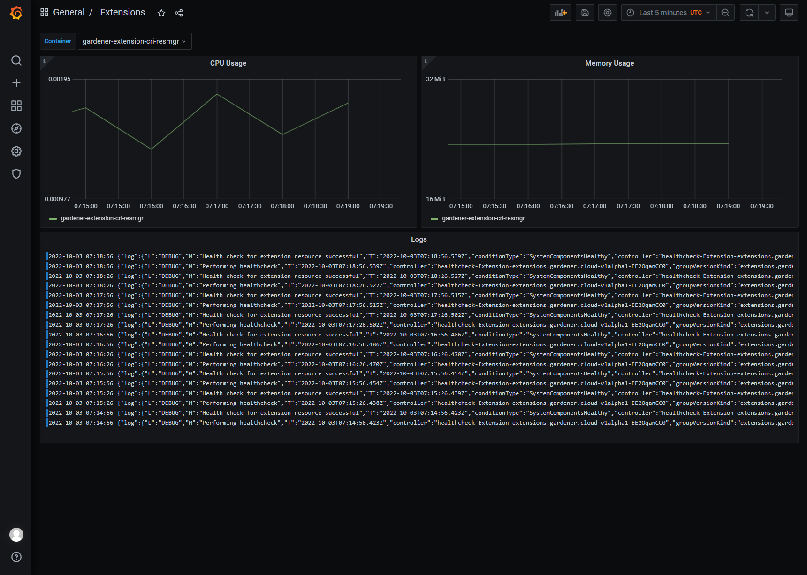
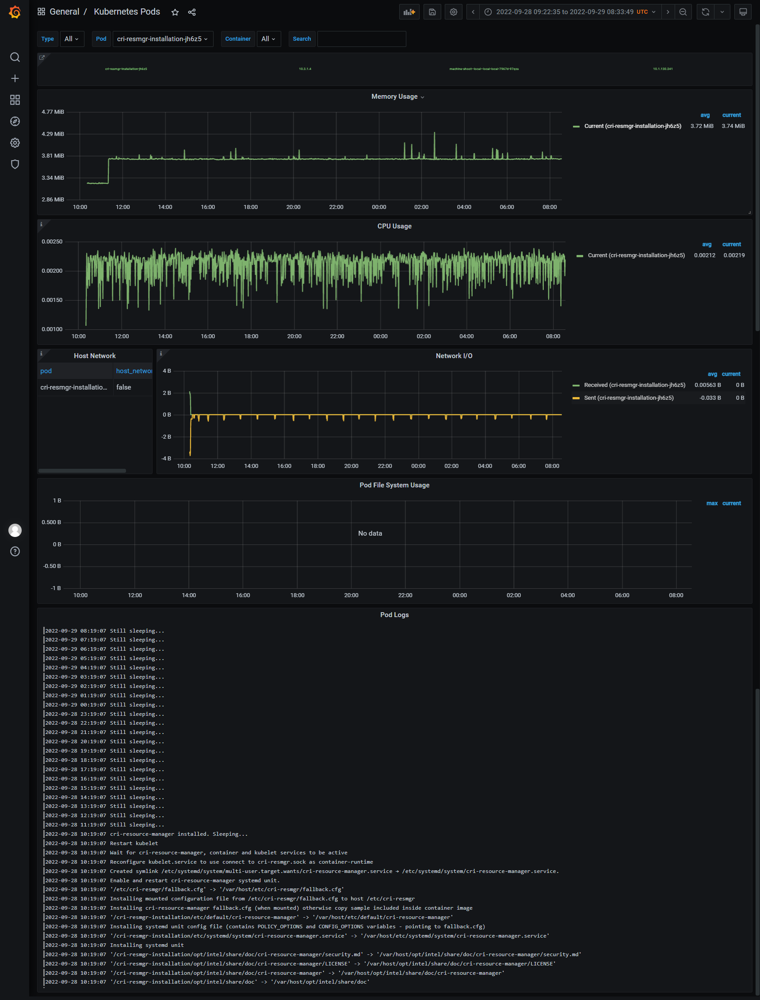
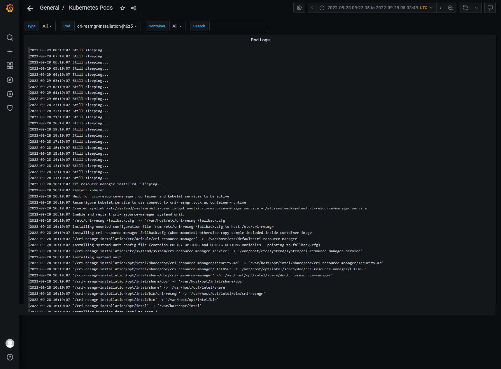
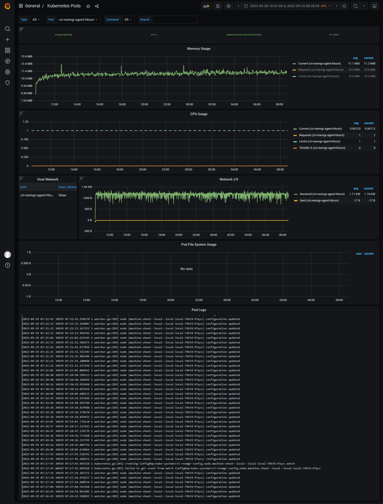
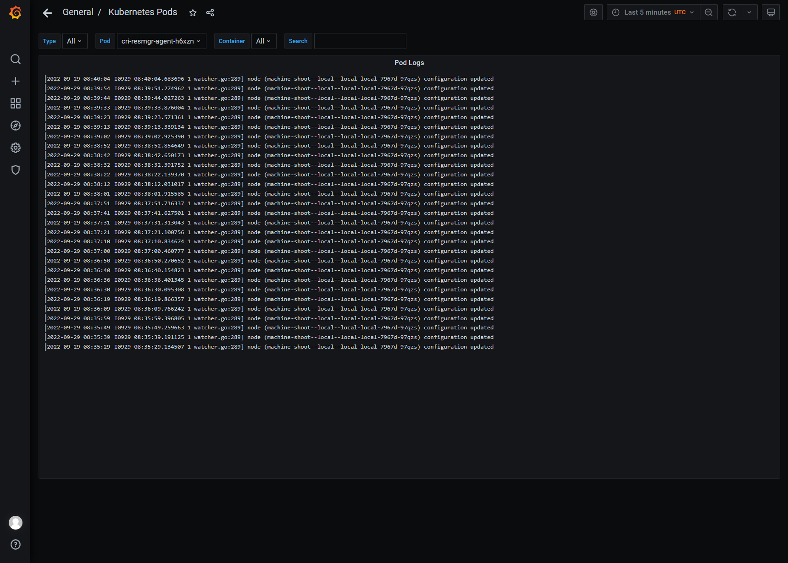
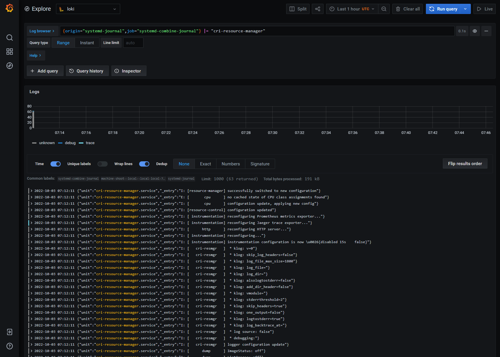
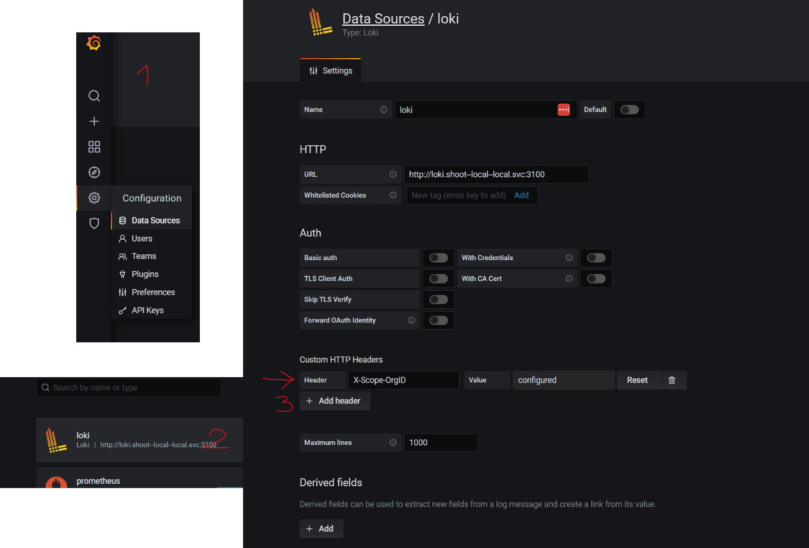

# CRI-Resource-Manager extension for Gardener*


| **Warning** |
| ---------------- |
| Code in **master** branch is "work in progress" and not meant to run in **production** environment! |

### Introduction

This Gardener extension will deploy and manage lifecycle of [CRI-Resource-Manager](https://github.com/intel/cri-resource-manager) in "shoot" clusters worker nodes deployed by Gardener. **CRI-Resource-Manager** is a proxy between kubectl and containerd to allow more sophisticated node resource management.

### Requirements

- `container-runtime` of shoot nodes must be configured to **containerd** 
- for production usage: **docker image registry** where installation and extension images can be pushed (until #47 is resolved)
- for local development: Gardener v1.56.0

### Features

- Automatic **installation** of CRI-Resource-Manager as systemd unit - using installation `DaemonSet`,
- Support for **removal** of CRI-Resource-Manager from system in the following cases: 
    - when extension is enabled globally but later disabled by shoot 
    - disabled globally but later enabled and disabled for shoot 
    - `ControllerRegistration` is removed and there are already Shoots deployed with extension
- **healthcheck** of cri-resource-manager which reports back to **ControllerInstallation** Healthy condition based on liveness probe that calls "`systemctl status cri-resource-manager`"
- CRI-Resource-Manager **configuration overwriting && types** - user can provide "fallback", "default", "per node", "per group" or "force" configuration in `ControllerDeployment` which can be later overridden by Shoot "owner" with `providerConfig` - more information [here](#configuring-cri-resource-manager)
- **dynamic configuration** - "default", "per node" or "per group" configuration are propagated from `ControllerDeployment` and `Shoot.Extension.ProviderConfig` to CRI-Resource-Manager through cri-resmgr-agent
- [**Adjustments**](https://intel.github.io/cri-resource-manager/stable/docs/setup.html#container-adjustments) CRI-Resource-Manager CRD to have more granular control
- Access to **logs** of `installation DaemonSet`, CRI-Resource-Manager systemd service, cri-resmgr-agent and extension itself to troubleshoot and debug

Missing/TODO:
- Ability to 'selectively' install cri-resource-manager on specific hosts or worker groups [issue here](https://github.com/intel/gardener-extension-cri-resmgr/issues/10),
- Allow changing policy (requires implementing policy switching [this procedure](https://intel.github.io/cri-resource-manager/stable/docs/setup.html#changing-the-active-policy) - more information in the [issue](https://github.com/intel/gardener-extension-cri-resmgr/issues/29),
- HighAvailability + horizontal/vertical autoscaling with VPA/HPA/HVPA + leader election [#6](https://github.com/intel/gardener-extension-cri-resmgr/issues/6)
- Configuring images with ImageVector based on Kubernetes version is not supported 

### How CRI-Resource-Manager is deployed

There are two charts:

- charts/**gardener-extension-cri-resmgr** - used to deploy extension (by deploying "extension" image) in **Seed** cluster - it is not deployed manually but uses `ControllerRegistration` and `ControllerDeployment` manifest in `examples/ctrldeploy-ctrlreg.yaml` which are generated by script `hacks/generate-controller-registration.sh`,
- charts/internal/**cri-resmgr-installation** - internal chart that is included inside "installation" image and used to install `cri-resource-manager` binary inside worker nodes in **Shoot** clusters - it is not meant to be run manually but rather deployed by **gardener-extension-cri-resmgr** extension Pod

## Configuring CRI-resource-manager

There are multiple options to pass configuration file to CRI-Resource-Manager systemd unit:

* a) using `configs` key in Helm chart values section:

```
apiVersion: core.gardener.cloud/v1beta1
kind: ControllerDeployment
metadata:
  name: cri-resmgr-extension
type: helm
providerConfig:
  chart: H4sI....
  values:
    configs:
      default: |
        ... SOME DEFAULT CONFIG ...
```

in above example "default" config will be used for all the shoots,

* b) setting `configs` key in  `providerConfig` Shoot spec:

```
apiVersion: core.gardener.cloud/v1beta1
kind: Shoot
metadata:
  name: local
spec:
  ...
  extensions:
  - type: cri-resmgr-extension
    providerConfig:
      configs:
        fallback: |+
        ... SOME DEFAULT CONFIG ...
        default: |+
        ... SOME DEFAULT CONFIG ...
```

`configs` specified in Shoot definition will override `configs` provided by `ControllerDeployment`.

Each key of `configs` will generate `ConfigMap` in the `kube-system` namespace with following name:

`cri-resmgr-config.TYPE` e.g. `cri-resmgr-config.default`

types `default` and `fallback` have special meaning:

* **fallback** will be mounted inside installation DaemonSet and copied to /etc/cri-resmgr/fallback.cfg - this config is used before cri-resmgr-agent can push "dynamic" configuration (lowest priority)
* **default** will used by cri-resmgr-agent to **override** **fallback** config on all the nodes,
* **node.$NODE_NAME** will be used by cri-resmgr-agent and applied only to specified nodes with name NODE_NAME 
* **group.$GROUP_NAME** will be used by cri-resmgr-agent and applied only to nodes with specific label "cri-resource-manager.intel.com/group=GROUP_NAME" - works best when worker groups has additional labels  in `shoot.spec.provider.workers.labels`
* **force** will be used to override "configuration" pushed by cri-resmgr-agent (highest priority) (essentially adds `--force-config` to cri-resource-manager process in systemd unit definition so CRI-Resource-Manager ignores configuration from cri-resmgr-agent) 


More about priorities and type of config can be found here:

* https://intel.github.io/cri-resource-manager/stable/docs/cri-resmgr-agent.html
* https://intel.github.io/cri-resource-manager/stable/docs/setup.html#using-cri-resource-manager-agent-and-a-configmap

## Getting started

### I. Deploying to Gardener.

#### 1. Prepare images.

Build and publish docker images for extension, installation and cri-resmgr-agent with your own registry.

For example lets assume that we want to use `v2.isvimgreg.com` as registry with specific tag called `mybranch`:

```
make REGISTRY=v2.isvimgreg.com/ TAG=mybranch build-images push-images
```

Then overwrite images in **ControllerDeployment** and provider "fallback" config to be used before CRI-resource-manager syncs with cri-resmgr-agent:

```yaml
apiVersion: core.gardener.cloud/v1beta1
kind: ControllerDeployment
metadata:
  name: cri-resmgr-extension
type: helm
providerConfig:
  chart: H4sIAAAAAAAA....
  values:
   image:
     repository: v2.isvimgreg.com/gardener-extension-cri-resmgr
     tag: mybranch
     pullPolicy: Always
   imageVectorOverwrite: |
     images:
     - name: gardener-extension-cri-resmgr-installation
       tag: mybranch
       repository: v2.isvimgreg.com/gardener-extension-cri-resmgr-installation
     - name: gardener-extension-cri-resmgr-agent
       tag: mybranch
       repository: v2.isvimgreg.com/gardener-extension-cri-resmgr-agent
    configs:
      fallback: |
        ### This is default policy from CRI-resource-manage fallback.cfg.sample
        policy:
          Active: topology-aware
          ReservedResources:
            CPU: 750m
        logger:
          Debug: resource-manager,cache,policy,resource-control
        dump:
          Config: off:.*,full:((Create)|(Remove)|(Run)|(Update)|(Start)|(Stop)).*
```


#### 2. Install extension by creating **ControllerRegistration** and **ControllerDeployment** in garden cluster.

```
kubectl apply -f examples/ctrldeploy-ctrlreg.yaml
```

note that extension is *not* enabled globally so you need to include it in shoot spec definition like this:

```yaml
spec:
  extensions:
  - type: cri-resmgr-extension
```

### II. Deploying locally.

Steps below show how to deploy Gardener with local-provider (kind based) and then deploy and configure gardener-extension-cri-resmgr to a Shoot.

This is fully working example that uses local deployed gardener and shoot created in kind cluster.
This is based on https://github.com/gardener/gardener/blob/master/docs/deployment/getting_started_locally.md

#### Prerequisites

- *kubectl* 1.20+
- working dir for `mkdir ~/work`
- *gardener-extension-cri-resmgr* is cloned to ~/work path like this:
    ```sh
    git clone https://github.com/intel/gardener-extension-cri-resmgr ~/work/gardener-extension-cri-resmgr
    ```

#### Prepare local kind-based garden cluster

##### 1. Clone the gardener

```sh
mkdir -p ~/work/
git clone https://github.com/gardener/gardener ~/work/gardener
cd ~/work/gardener
git checkout v1.56.0
cd -
```

##### 2. Prepare kind cluster 

```sh
make -C ~/work/gardener kind-up

kubectl cluster-info --context kind-gardener-local --kubeconfig ~/work/gardener/example/gardener-local/kind/kubeconfig
# WARNING!: this overwrites your local kubeconfig
cp ~/work/gardener/example/gardener-local/kind/kubeconfig ~/.kube/config
```

Check that kind cluster is ready:

```sh
kubectl get nodes
```

#####  3. Deploy local gardener

```sh
make -C ~/work/gardener/ gardener-up
```

Check that three gardener charts are installed:

```sh
helm list -n garden -a
```

#### Deploy cri-resmgr extension

##### 1. (Optional) Regenerate ctrldeploy-ctrlreg.yaml file:

```sh
./hacks/generate-controller-registration.sh
```

##### 2. Deploy cri-resmgr-extension as Gardener extension using ControllerRegistration/ControllerDeployment

```sh
kubectl apply -f ./examples/ctrldeploy-ctrlreg.yaml
```

By default generated "ControllerRegistration" is not enabled globally, so you need to include this extension in shoot definition. Check [this shoot.yaml](examples/shoot.yaml) as example.

Checkout installed objects:

```sh
kubectl get controllerregistrations.core.gardener.cloud cri-resmgr-extension
kubectl get controllerdeployments.core.gardener.cloud cri-resmgr-extension
```

There should be 'cri-resmgr-extension   Extension/cri-resmgr-extension' resources visible alongside cri-resmgr-extension deployment.

Remember that "controller installation" should not be yet available - there is not shoot cluster deployed yet and extension is disabled by default.

```sh
kubectl get controllerinstallation.core.gardener.cloud 
```

should no return "cri-resmgr extension" installation.

##### 3. Deploy shoot "local" cluster.

Build an image with extension and upload to local kind cluster

```sh
make build-images push-images
```

by default ``localhost:5001`` registry is used (check 'Build and publish docker images' section for more info)

Create shoot:

```sh
kubectl apply -f examples/shoot.yaml
```

Check that shoot cluster is ready:

```sh
kubectl get shoots -n garden-local --watch -o wide
```

In our shoot example, the extensions is also disabled by default and need to be enabled after shoot is created with following command:

```sh
kubectl patch shoot local -n garden-local -p '{"spec":{"extensions": [ {"type": "cri-resmgr-extension", "disabled": false} ] } }'
```

##### 4. Verify that ManagedResources are properly installed in shoot 'garden' (seed class) and  'shoot--local--local' namespace

```sh
kubectl get managedresource -n garden | grep cri-resmgr-extension
kubectl get managedresource -n shoot--local--local | grep extension-runtime-cri-resmgr
```

##### 5. Check shoot cluster node is ready

First get credentials to access shoot cluster:

```sh 
kubectl -n garden-local get secret local.kubeconfig -o jsonpath={.data.kubeconfig} | base64 -d > /tmp/kubeconfig-shoot-local.yaml
```

... and check status of the node/pods:

```sh
kubectl --kubeconfig=/tmp/kubeconfig-shoot-local.yaml get nodes
kubectl --kubeconfig=/tmp/kubeconfig-shoot-local.yaml get pods -A
```

##### 6. Check CRI-resource-manager is installed properly as proxy

```sh
kubectl exec -n shoot--local--local `kubectl get pod -n shoot--local--local --no-headers G machine-shoot | awk '{print $1}'` -- systemctl status cri-resource-manager kubelet -n 0
```

We should observe that:

1. **cri-resource-manager** is installed as service

```
● cri-resource-manager.service - A CRI proxy with (hardware) resource aware container placement policies.
     Loaded: loaded (/etc/systemd/system/cri-resource-manager.service; enabled; vendor preset: enabled)
     Active: active (running) since Wed 2022-06-29 20:21:33 UTC; 2min 14s ago
       Docs: https://github.com/intel/cri-resource-manager
   Main PID: 10937 (cri-resmgr)
      Tasks: 6 (limit: 69411)
     Memory: 19.5M
     CGroup: /docker/c4cf6958c7757cd0d66aed793a7d19f6364d936a9761c7f49c33894a65caab66/kubelet.slice/kubelet-kubepods.slice/kubelet-kubepods-besteffort.slice/kubelet-kubepods-besteffort-pod9c7ece81_7d98_4884_b214_8f2389308241.slice/cri-containerd-70b98bdb42eec15c4df4cd520d79105b7420f7be4997f4ae8f4b17503d006df4.scope/system.slice/cri-resource-manager.service
             └─10937 /opt/intel/bin/cri-resmgr --fallback-config /etc/cri-resmgr/fallback.cfg
```

2. **kubelet** was reconfigured to use ``cri-resmgr.sock`` as its ``container-runtime-endpoint`` command line option:

```
● kubelet.service - kubelet daemon
     Loaded: loaded (/etc/systemd/system/kubelet.service; enabled; vendor preset: enabled)
     Active: active (running) since Wed 2022-06-29 20:21:39 UTC; 2min 9s ago
       Docs: https://kubernetes.io/docs/admin/kubelet
    Process: 11138 ExecStartPre=/var/lib/kubelet/copy-kubernetes-binary.sh kubelet (code=exited, status=0/SUCCESS)
   Main PID: 11141 (kubelet)
      Tasks: 13 (limit: 69411)
     Memory: 57.1M
     CGroup: /docker/c4cf6958c7757cd0d66aed793a7d19f6364d936a9761c7f49c33894a65caab66/kubelet.slice/kubelet-kubepods.slice/kubelet-kubepods-besteffort.slice/kubelet-kubepods-besteffort-pod9c7ece81_7d98_4884_b214_8f2389308241.slice/cri-containerd-70b98bdb42eec15c4df4cd520d79105b7420f7be4997f4ae8f4b17503d006df4.scope/system.slice/kubelet.service
             └─11141 /opt/bin/kubelet 
             --bootstrap-kubeconfig=/var/lib/kubelet/kubeconfig-bootstrap 
             --config=/var/lib/kubelet/config/kubelet 
             --kubeconfig=/var/lib/kubelet/kubeconfig-real 
             --node-labels=worker.gardener.cloud/kubernetes-version=1.24.0 
             --container-runtime=remote 
             --v=2 
             --container-runtime-endpoint=/var/run/cri-resmgr/cri-resmgr.sock # <---
```

##### 7. Uninstalling (disabling) cri-resource-manager extension

You can disable "cri-resmgr extension" in existing shoot to uninstall cri-resource-manager from shoot worker node like this:

```sh
kubectl patch shoot local -n garden-local -p '{"spec":{"extensions": [ {"type": "cri-resmgr-extension", "disabled": true} ] } }'
```

now after executing this:

```sh
kubectl exec -n shoot--local--local `kubectl get pod -n shoot--local--local --no-headers G machine-shoot | awk '{print $1}'` -- systemctl status cri-resource-manager kubelet -n 0
```

there should not be "cri-resource-manager" systemd service unit anymore 

```
Unit cri-resource-manager.service could not be found.
```

... and "kubelet" should connect to containerd.sock as it was by default.

```
● kubelet.service - kubelet daemon
     Loaded: loaded (/etc/systemd/system/kubelet.service; enabled; vendor preset: enabled)
     Active: active (running) since Wed 2022-06-29 20:49:31 UTC; 1min 19s ago
       Docs: https://kubernetes.io/docs/admin/kubelet
    Process: 32351 ExecStartPre=/var/lib/kubelet/copy-kubernetes-binary.sh kubelet (code=exited, status=0/SUCCESS)
   Main PID: 32354 (kubelet)
      Tasks: 12 (limit: 69411)
     Memory: 64.7M
     CGroup: /docker/c4cf6958c7757cd0d66aed793a7d19f6364d936a9761c7f49c33894a65caab66/kubelet.slice/kubelet-kubepods.slice/kubelet-kubepods-besteffort.slice/kubelet-kubepods-besteffort-pod9c7ece81_7d98_4884_b214_8f2389308241.slice/cri-containerd-70b98bdb42eec15c4df4cd520d79105b7420f7be4997f4ae8f4b17503d006df4.scope/system.slice/kubelet.service
             └─32354 /opt/bin/kubelet 
             --bootstrap-kubeconfig=/var/lib/kubelet/kubeconfig-bootstrap 
             --config=/var/lib/kubelet/config/kubelet 
             --kubeconfig=/var/lib/kubelet/kubeconfig-real 
             --node-labels=worker.gardener.cloud/kubernetes-version=1.24.0 
             --container-runtime=remote 
             --v=2 
             --container-runtime-endpoint=unix:///run/containerd/containerd.sock  # <---
```

## Troubleshooting and debugging issues

### Deployment and propagation of changes

In garden virtual and seed clusters you should monitor and watch over following process:

1. `ControllerRegistration/cri-resmgr-extension` results in `ControllerInstallation/cri-resmgr-extension` (reconciled by **gardener-controller-manager**),
1. `ControllerInstallation/cri-resmgr-extension` Valid/Installed/Healthy conditions are true - those conditions are based on `ManagedResource/cri-resmgr-extension-*` (synced by **gardenlet/controllerinstallation_care controller**),
1. `ManagedResource/cri-resmgr-extension-*` of `type=seed` results in deploying `Pod/cri-resmgr-extension` in seed cluster (**reconciled by gardener-resource-manager**),
1. (Optionally) if configs are defined, the additional `ConfigMap/gardener-extension-cri-resmgr-configs` should be created in `extension-cri-resmgr-extension-XXXX` namespace with keys representing different kind of configs (e.g. fallback/default),
1. At the end of shoot reconciliation process, **gardenlet** creates `Extension/cri-resource-manager` watched by `Pod/cri-resmgr-extension` which initiates deployment of CRI-resource-manager to shoot worker nodes,
1. CRI-Resource-Manager deployment is implemented by creating `ManagedResource/extension-runtime-cri-resmgr` for shoot that consists of installation chart (agent and installation DaemonSets and optional `ConfigMap/cri-resmgr-config.TYPE` configs),
1. After **gardener-resource-manager** reconciles `ManagedResources/extension-runtime-cri-resmgr` for shoot - conditions of those newly created resources (2 x DaemonsSets with liveness probes) are monitored by `Pod/cri-resmgr-extension` and reported in `Extension/cri-resmgr-extension` status( `SystemComponentsHealthy` condition),
1. Condition of `Extensions/cri-resmgr-extension` is monitored by **gardenlet/shoot_care** controller and affects finally `Shoot.status.conditions`

In a shoot, we expect two DaemonSets to be deployed:
- **cri-resmgr-agent** - that Ready status is based on probe that tries to connect to local CRI-Resource-Manager process,
- **cri-resmgr-installation** - which copies binaries, configures CRI-resource-manager and then reconfigures and restarts kubelet and then goes to sleep - its Ready status is based on probe that checks "systemctl status cri-resource-manager"

#### Logging in terminal
To debug issues you can consult logs of following components (commands are for local kind-based Gardener deployment):

1. Seed context: `Pod/cri-resmgr-extension` - can be accessed by: 
   ```sh
   kubectl logs -n extension-cri-resmgr-extension-XXXXX deploy/gardener-extension-cri-resmgr
   ```
1. Shoot context: `DaemonSet/installation `:
   ```sh
   kubectl logs -n kube-system ds/cri-resmgr-installation
   ```
1. Shoot context: `Pod/cri-resmgr-agent`: 
   ```sh
   kubectl logs -n kube-system ds/cri-resmgr-agent
   ```
1. Seed context: `cri-resource-manager` systemd unit:
   ```sh
   # Enable port-forward to shoot's loki: 
   kubectl port-forward -n shoot--local--local service/loki 3100:3100 &

   # Then query for metrics from loki
   logcli query --org-id="operator" '{job="systemd-combine-journal"} | unpack | unit="cri-resource-manager.service"'
   ```
   Loki client `logcli` can be found [here](https://grafana.com/docs/loki/latest/tools/logcli/).
   Note you can specify additional label `nodename="machine-shoot--local--local-local-XXXXX-XXXXX"` to get logs from specific node.

   In case of issues it is worth to consult: **kubelet** and **containerd** systemd services logs following commands:
   ```
   # For kubelet
   logcli query --org-id="operator" '{unit="kubelet.service"}'
   # For containerd
   logcli query --org-id="operator" '{unit="containerd.service"}'
   ```
#### Logging in Grafana

Logs could be watched from containers, but easily it is from one point - Grafana. Logs for exentsion are avialable in grafana in namespace garden. Logs for cri-resmeg-installation, cri-resmeg-agent and cri-resource-manager in seed grafana.

##### cri-extension
You can check the logs in Grafana - svc/grafana namespace garden.

Loki expression 
> {container_name="gardener-extension-cri-resmgr"}

Dashboard grafana
<a href="./doc/cri-resmeg-extension.png">

</a>

##### cri-rm-installation and cri-rm-agent
You can check the logs in Grafana - svc/grafana-operators in seed namespace.

Loki expression
>{pod_name="cri-resmgr-installation-XXXXX"} 
>{pod_name="cri-resmgr-agent-XXXXX"} 

Installation dashboard grafana
<a href="./doc/cri-resmeg-installation-full.png">

</a>
<a href="./doc/cri-resmeg-installation-logs.png">

</a>

Agent dashboard grafana
<a href="./doc/cri-resmeg-agent-full.png">

</a>
<a href="./doc/cri-resmeg-agent-logs.png">

</a>

##### cri-resource-manager 
You can check the logs in Grafana - svc/grafana-operators in seed namespace.

Loki expression 
{node="machine-shoot-xxx",origin="systemd-journal",job="systemd-combine-journal"} |= "cri-resource-manager"

Dashboard grafana
<a href="./doc/cri-resmeg.png">

</a>

#### Bug in kind local gardener Grafana operator Loki configuration

Login and password are default - admin/admin

And there is a missing configuration in the HTTP header:
> X-Scope-OrgID:operator

<a href="./doc/fix_grafana_loki.png">

</a>

### Running e2e tests.

Assuming having gardner cloned in ~/work/gardener

and already set /etc/hosts properly with following entries:
```
127.0.0.1 api.e2e-default.local.external.local.gardener.cloud
127.0.0.1 api.e2e-default.local.internal.local.gardener.cloud
```

then:
```
make -C ~/work/gardener kind-up
cp ~/work/gardener/example/gardener-local/kind/kubeconfig ~/.kube/config
./hacks/kind-load-images.sh
make -C ~/work/gardener gardener-up
kubectl apply -f ./examples/ctrldeploy-ctrlreg.yaml
make e2e-tests KUBECONFIG=$HOME/.kube/config
```

Additional options available provided by test framework:
when running manually with ginkgo:
```
KUBECONFIG=$HOME/.kube/config ginkgo -v --progress --label-filter enable ./test/e2e/... -- -verbose debug -disable-dump -project-namespace testbroken
```

```
  -disable-dump
        Disable the state dump if a test fails
  -existing-shoot-name string
        Name of an existing shoot to use instead of creating a new one.
  -kubecfg string
        the path to the kubeconfig  of the garden cluster that will be used for integration tests
  -project-namespace string
        specify the gardener project namespace to run tests
  -skip-accessing-shoot
        if set to true then the test does not try to access the shoot via its kubeconfig
  -verbose string
        verbosity level (defaults to info)
```

access to e2e shoot with k9s example:

```
k9s --kubeconfig <(kubectl view-secret -n garden-local e2e-default.kubeconfig kubeconfig)

```
